# XP Guardian - API de Controle de Apostas e Sugestão de Investimentos


---

## 📝 Descrição do Projeto

O **XP Guardian** é um serviço RESTful desenvolvido em Java 21 e Spring Boot 3, que simula uma funcionalidade para o Banco XP. A API tem o objetivo de identificar e bloquear transações financeiras destinadas a casas de apostas e, proativamente, sugerir ao cliente a aplicação do valor economizado em produtos de investimento oferecidos pelo banco.

Este projeto foi desenvolvido para demonstrar boas práticas de arquitetura de software, código limpo, e o uso de tecnologias modernas no ecossistema Java.

------

### Projeto acadêmico

Desenvolvedores:
- Leticia Fontana Baptista - RM 550289
- ⁠Julia Palomari - RM 551910
- ⁠Vinicius Sobreira Borges - RM 97767
- ⁠Julia Ortiz - RM 550204
- Guilherme Catelli Bichaco - RM 97989

---

## ✨ Features Principais

-   **Processamento de Transações**: Endpoint para receber e avaliar transações.
-   **Bloqueio Inteligente**: Identifica transações para casas de apostas (configurável) e as bloqueia.
-   **Sugestão de Investimentos**: Gera uma sugestão de investimento personalizada quando uma transação de aposta é bloqueada.
-   **Consulta de Clientes**: Permite consultar dados de clientes e suas sugestões de investimento.
-   **Tratamento de Erros**: Respostas de erro padronizadas e claras.

## 🚀 Tecnologias Utilizadas

-   **Linguagem**: Java 21
-   **Framework**: Spring Boot 3.x
-   **Banco de Dados**: H2 (In-Memory)
-   **Persistência**: Spring Data JPA / Hibernate
-   **Migrações**: Flyway
-   **Build Tool**: Maven
-   **Validação**: Jakarta Bean Validation
-   **Utilitários**: Lombok
-   **Testes da API**: Postman / cURL

## 🏛️ Arquitetura

A aplicação segue uma arquitetura em camadas bem definida para garantir a separação de responsabilidades, manutenibilidade e escalabilidade.

-   **Controller Layer**: Responsável por expor os endpoints REST, receber as requisições HTTP, validar os dados de entrada (DTOs) e delegar a lógica de negócio para a camada de serviço.
-   **Service Layer**: Contém a lógica de negócio principal da aplicação. Orquestra as operações entre os repositórios e outros serviços.
-   **Repository Layer**: Camada de acesso a dados, utilizando Spring Data JPA para abstrair a comunicação com o banco de dados.
-   **Domain/Model**: Contém as entidades JPA que representam as tabelas do banco de dados.
-   **DTOs (Data Transfer Objects)**: Objetos para transferir dados entre as camadas, especialmente entre a Controller e a Service, evitando a exposição das entidades de domínio.

## 📊 Diagramas do Projeto

### Arquitetura de Camadas
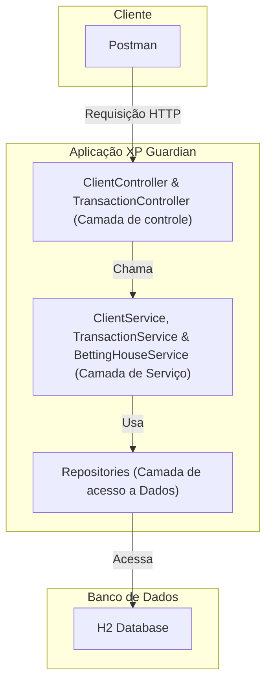

### Diagrama de Entidades (ER Diagram)
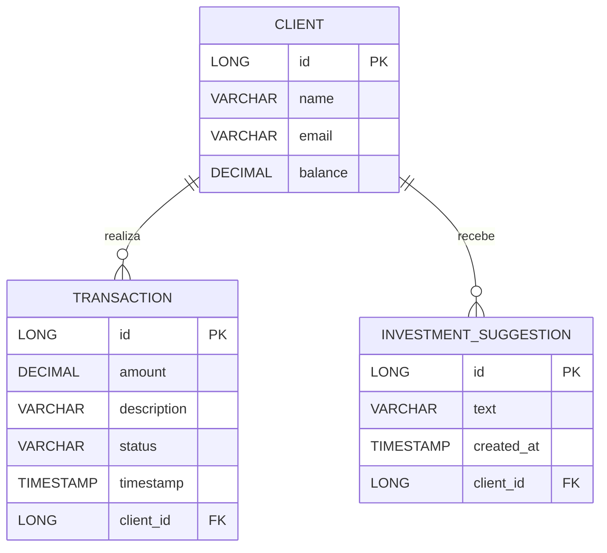

### Diagrama de Casos de Uso
Diagrama de Casos de Uso

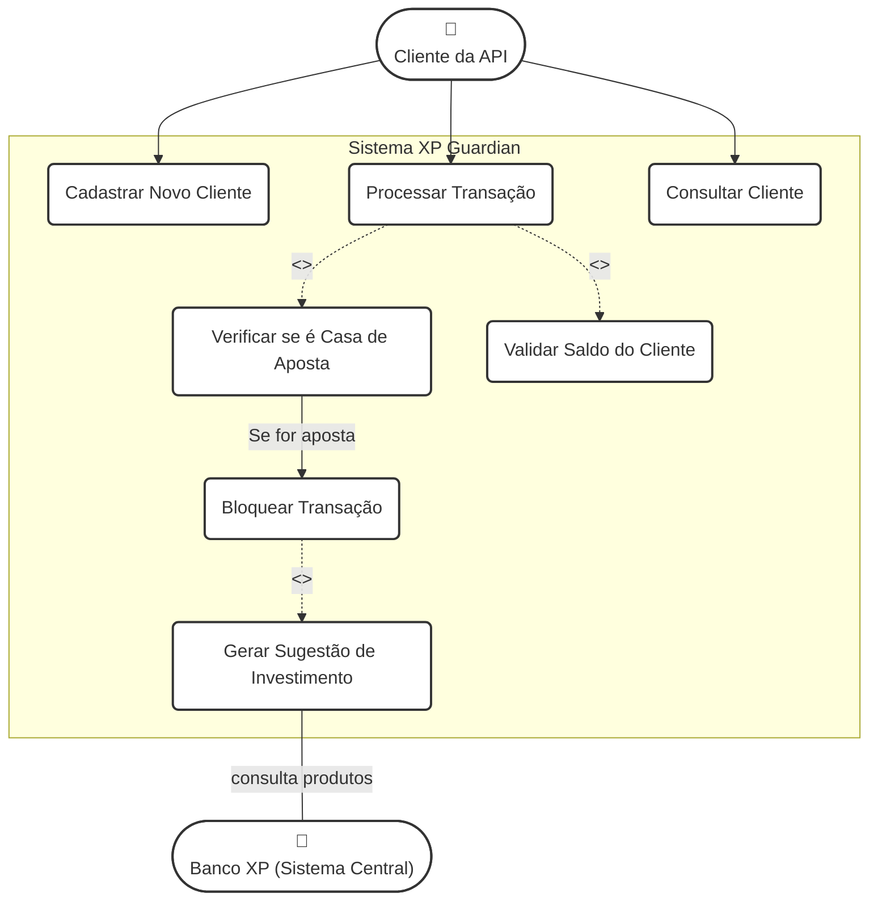
---

### Mapeamento dos Casos de Uso para Serviços

A tabela a seguir representa de forma clara como cada caso de uso do sistema é implementado através de um serviço específico (endpoint da API) e qual componente da camada de serviço contém a lógica de negócio correspondente.

| Caso de Uso | Ator Principal | Endpoint da API (O Serviço) | Serviço Responsável (A Implementação) | Descrição |
| :--- | :--- | :--- | :--- | :--- |
| **Cadastrar Novo Cliente** | Cliente da API | `POST /api/v1/clients` | `ClientService.createClient()` | Cria um novo cliente no sistema com nome, email e saldo inicial. |
| **Processar Transação** | Cliente da API | `POST /api/v1/transactions` | `TransactionService.processTransaction()` | Ponto de entrada para qualquer transação. Orquestra a verificação para determinar se a transação é normal ou para uma casa de apostas. |
| **Bloquear Transação de Aposta** | (Sistema) | (Resultado do `POST /api/v1/transactions`) | `TransactionService.blockTransactionAndSuggestInvestment()` | Resultado do caso de uso "Processar Transação". O status da transação é definido como `BLOCKED` e ela é salva sem debitar o saldo do cliente. |
| **Gerar Sugestão de Investimento** | (Sistema) | (Resultado do `POST /api/v1/transactions`) | `TransactionService.createSuggestion()` | Consequência do bloqueio de uma transação. Uma nova entidade `InvestmentSuggestion` é criada e associada ao cliente. |
| **Consultar Dados do Cliente** | Cliente da API | `GET /api/v1/clients/{id}` | `ClientService.findClientById()` | Retorna os detalhes de um cliente específico, incluindo seu saldo atualizado e a lista de sugestões de investimento recebidas. |

---

## 🔧 Configuração e Execução

### Pré-requisitos
* JDK 21 ou superior instalado.
* Apache Maven 3.8+ instalado.
* Uma IDE como IntelliJ IDEA ou VS Code.

### ❗️ Configuração Essencial da IDE (Lombok)
Este projeto utiliza **Lombok**. Para que sua IDE entenda o código e não mostre falsos erros, a configuração correta é fundamental.
1.  **Instale o Plugin do Lombok** na sua IDE.
2.  **Habilite o "Annotation Processing"** nas configurações da IDE (`Settings > Build, Execution, Deployment > Compiler > Annotation Processors`).
3.  Reinicie a IDE.

### Passos para Executar
1.  **Clone o repositório:**
    ```bash
    cd Desktop (se desejado)
    https://github.com/GuiBichaco/xp-guardian-soa-sprint.git
    cd xp-guardian-soa-sprint
    ```

2.  **Compile e execute o projeto com Maven:**
    ```bash
    mvn spring-boot:run
    ```

3.  A aplicação estará disponível em `http://localhost:8080`. O console do banco H2 pode ser acessado em `http://localhost:8080/h2-console`.

## 🚀 Guia de Uso com Postman

Este guia detalha como configurar o Postman para testar todos os endpoints da API XP Guardian.
---

- Abra o aplicação do Postman em seu computador.
- Se desejável, crie uma conta. (Para o nosso teste não será necessário)
- Selecione o "+" conforme a imagem abaixo para abrir uma nova guia de requisição e siga os próximos passos.

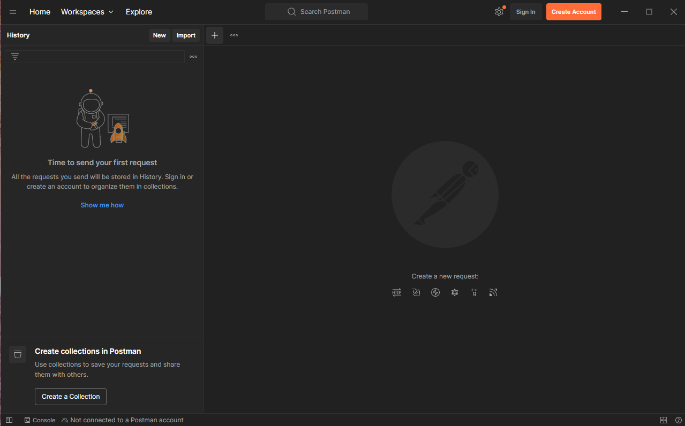
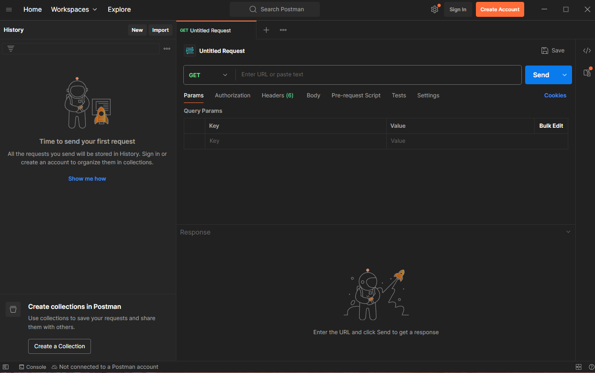

### Executando os Testes Passo a Passo

Adicione as seguintes requisições à sua collection `XP Guardian`.

#### 1. Cadastrar Novo Cliente

Cria um novo cliente no sistema.

1. Mude o método HTTP para **`POST`**.
4.  Na URL, digite: `localhost:8080/api/v1/clients`
5.  Vá para a aba **Body**.
6.  Selecione as opções `raw` e `JSON`.
7.  Cole o seguinte corpo (body):
    ```json
    {
      "name": "João da Silva",
      "email": "joao.silva@email.com",
      "initialBalance": 1000.00
    }
    ```
8.  Clique em **Send**.

* **Resultado Esperado:** Você deve receber um status `201 Created` e a resposta JSON com os dados do cliente. **Anote o `id` (ex: 1) para usar nos próximos passos.**

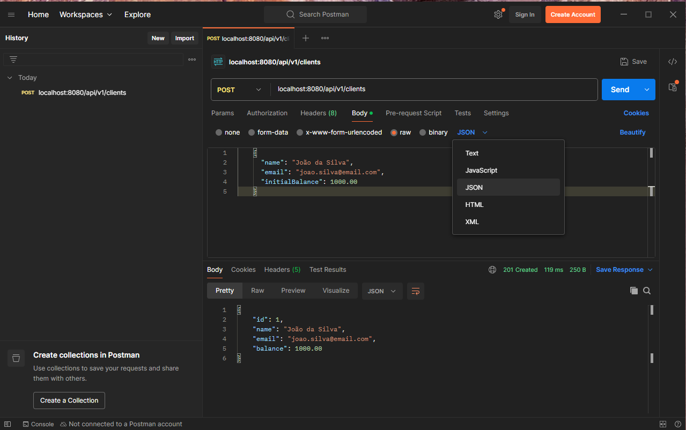

#### 2. Processar Transação Normal (Aprovada)

Simula uma transação comum que deve ser aprovada.

1.  Mantenha o método HTTP: **`POST`**
3.  URL: `localhost:8080/api/v1/transactions`
4.  Na aba **Body** (`raw`, `JSON`), cole:
    ```json
    {
      "clientId": 1,
      "amount": 75.50,
      "description": "Pagamento iFood"
    }
    ```
5.  Clique em **Send**.

* **Resultado Esperado:** Status `201 Created` e uma resposta com `"status": "APPROVED"`.

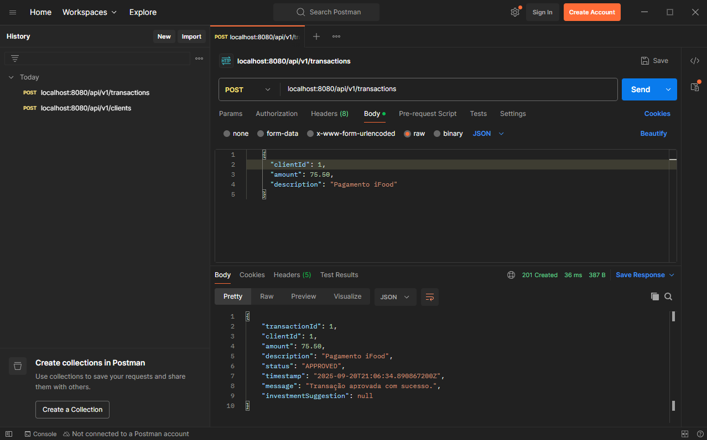

#### 3. Processar Transação de Aposta (Bloqueada)

Simula uma transação para uma casa de apostas, que deve ser bloqueada.

1.  Mantenha o metédo HTTP: **`POST`**
3.  URL: `localhost:8080/api/v1/transactions`
4.  Na aba **Body** (`raw`, `JSON`), cole:
    ```json
    {
      "clientId": 1,
      "amount": 100.00,
      "description": "Depósito para bet365 online"
    }
    ```
5.  Clique em **Send**.

* **Resultado Esperado:** Status `201 Created` e uma resposta com `"status": "BLOCKED"` e o objeto `investmentSuggestion` preenchido.

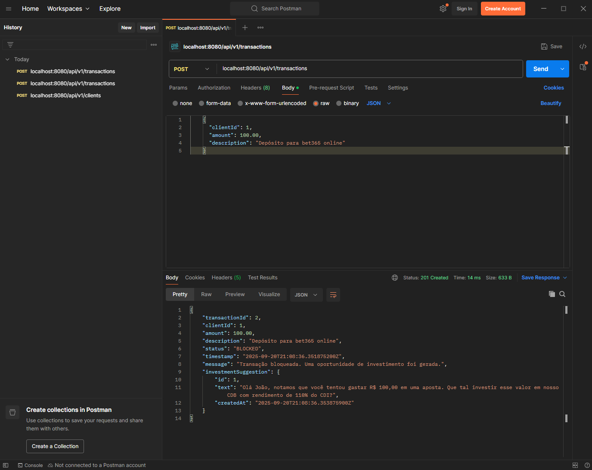

#### 4. Consultar Estado Final do Cliente

Verifica o saldo atualizado do cliente e a lista de sugestões de investimento.

1.  Alter o método HTTP para: **`GET`**
3.  URL: `{{baseUrl}}/api/v1/clients/1` (lembre-se de usar o `id` do cliente que você criou ou deseja consultar).
4.  Clique em **Send**.

* **Resultado Esperado:** Status `200 OK` e o corpo da resposta mostrando o `balance` atualizado (ex: `924.50`) e a lista `investmentSuggestions` com a sugestão gerada no passo anterior.

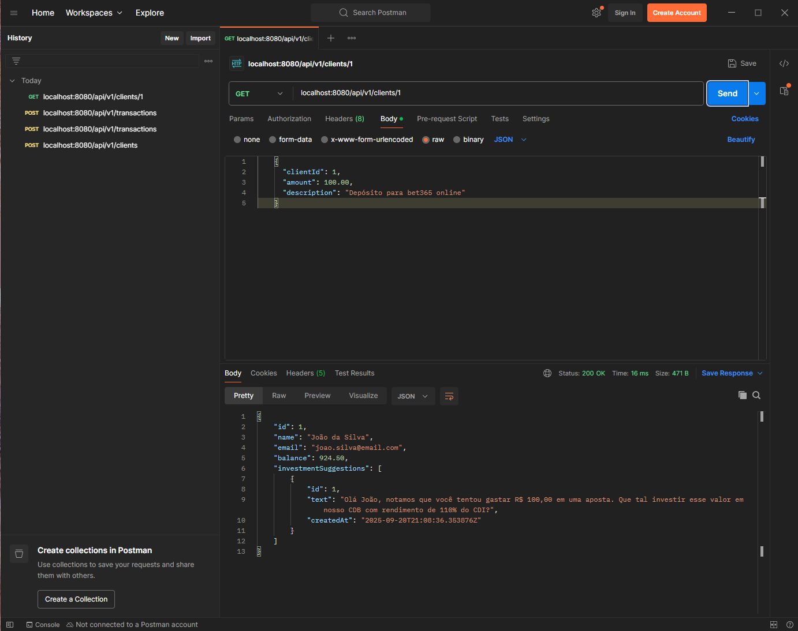

#### 5. Testar Erro de Cliente Inexistente (404)

Demonstra como a API lida com erros quando um recurso não é encontrado.

1.  Método: **`GET`**
3.  URL: `localhost:8080/api/v1/clients/999` (use um `id` que não existe).
4.  Clique em **Send**.

* **Resultado Esperado:** Status `404 Not Found` e uma resposta de erro JSON padronizada.

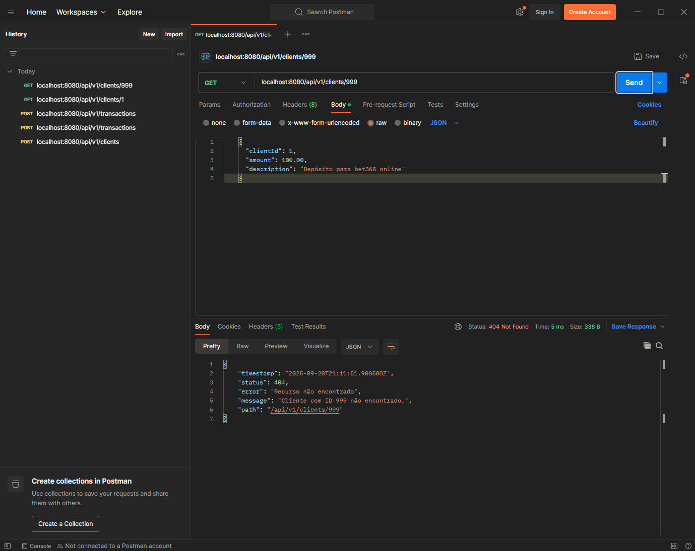

-----

## Banco de dados H2 

### Credenciais de conexão 
**Como é um banco local, baseado em memória do PC, não a problemas em questão de vazamento de usuário de conexão!**

- Link de acesso: ```localhost:8080/h2-console```
- Acesso ao banco do projeto: ```jdbc:h2:mem:xpdb```
- User: ```sa```
- Password: ```password```

Dados coletados de acordo com a operação feita no postman no processo anterior:

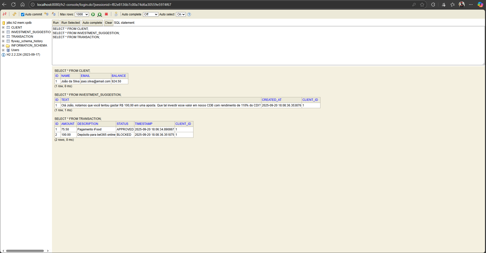