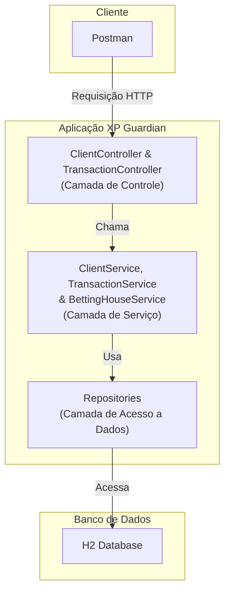
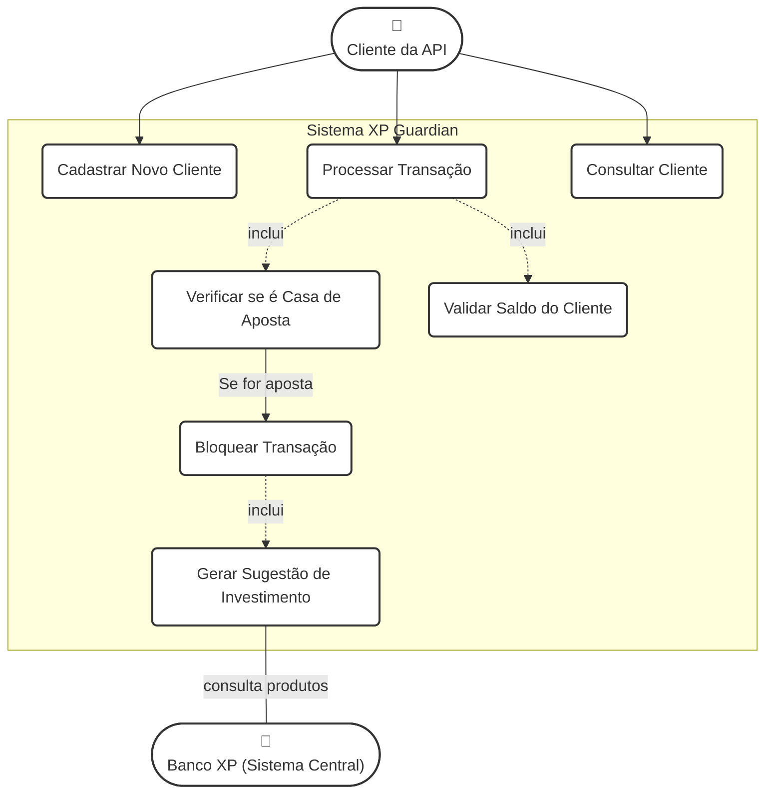

---

### Mapeamento dos Casos de Uso para Serviços

A tabela a seguir representa de forma clara como cada caso de uso do sistema é implementado através de um serviço específico (endpoint da API) e qual componente da camada de serviço contém a lógica de negócio correspondente.

| Caso de Uso | Ator Principal | Endpoint da API (O Serviço) | Serviço Responsável (A Implementação) | Descrição |
| :--- | :--- | :--- | :--- | :--- |
| **Cadastrar Novo Cliente** | Cliente da API | `POST /api/v1/clients` | `ClientService.createClient()` | Cria um novo cliente no sistema com nome, email e saldo inicial. |
| **Processar Transação** | Cliente da API | `POST /api/v1/transactions` | `TransactionService.processTransaction()` | Ponto de entrada para qualquer transação. Orquestra a verificação para determinar se a transação é normal ou para uma casa de apostas. |
| **Bloquear Transação de Aposta** | (Sistema) | (Resultado do `POST /api/v1/transactions`) | `TransactionService.blockTransactionAndSuggestInvestment()` | Resultado do caso de uso "Processar Transação". O status da transação é definido como `BLOCKED` e ela é salva sem debitar o saldo do cliente. |
| **Gerar Sugestão de Investimento** | (Sistema) | (Resultado do `POST /api/v1/transactions`) | `TransactionService.createSuggestion()` | Consequência do bloqueio de uma transação. Uma nova entidade `InvestmentSuggestion` é criada e associada ao cliente. |
| **Consultar Dados do Cliente** | Cliente da API | `GET /api/v1/clients/{id}` | `ClientService.findClientById()` | Retorna os detalhes de um cliente específico, incluindo seu saldo atualizado e a lista de sugestões de investimento recebidas. |

---

Diagrama de Arquitetura



---

 Diagrama de Entidades

 ```mermaid
erDiagram
    CLIENT {
        LONG id PK
        VARCHAR name
        VARCHAR email
        DECIMAL balance
    }

    TRANSACTION {
        LONG id PK
        DECIMAL amount
        VARCHAR description
        VARCHAR status
        TIMESTAMP timestamp
        LONG client_id FK
    }

    INVESTMENT_SUGGESTION {
        LONG id PK
        VARCHAR text
        TIMESTAMP created_at
        LONG client_id FK
    }

    CLIENT ||--o{ TRANSACTION : "realiza"
    CLIENT ||--o{ INVESTMENT_SUGGESTION : "recebe"
```

---

Diagrama de Casos de Uso




